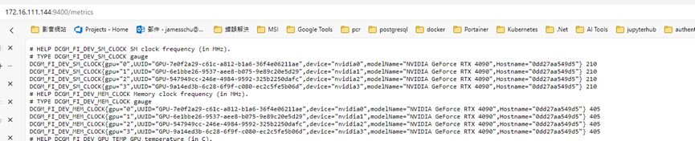
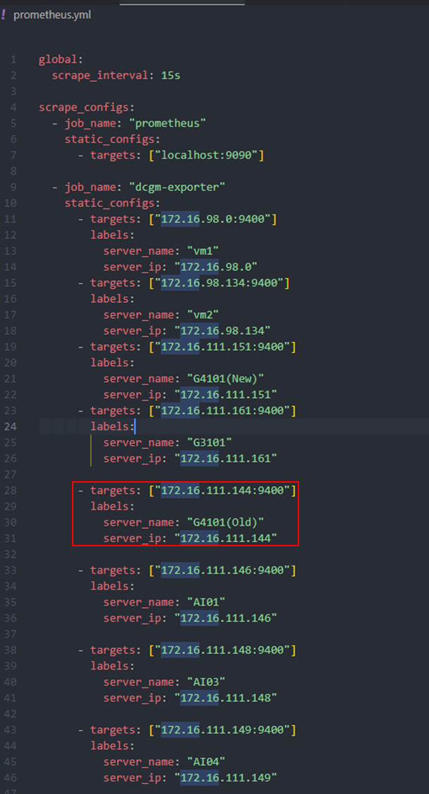
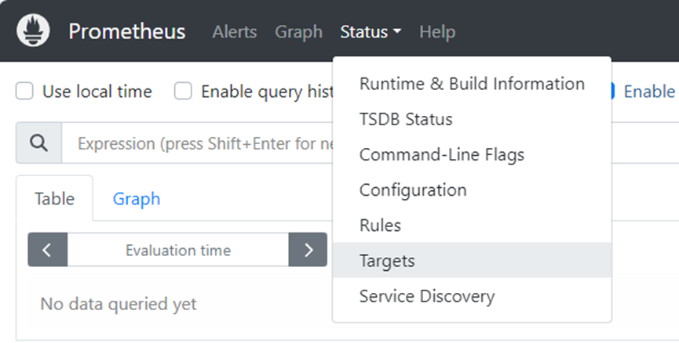
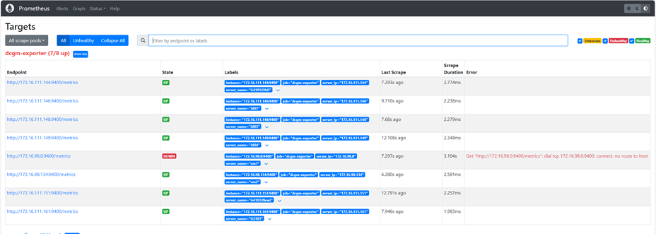

1. 被監控的Server一定要有gpu並且已安裝nvidia驅動程式
2. docker若已經先安裝，則必須要先停止所有容器
3. 需確保提供連線的帳號有系統的權限(主要是docker,若已經在運行腳本前就安裝，需要確認提供的帳號是否有針對docker執行或操作的權限)
4. 環境需要有python，所以建議要安裝Anaconda
5. 若腳本還是失敗則可以手動安裝嘗試

## 手動安裝流程

- 在執行腳本時若遇到錯誤問題，請先確認目標Server已經將所有docker容器關閉，或者可以手動將docker先關閉，並且請先確保該Server已經安裝正確的NVIDIA driver與NVIDIA Cuda，在腳本運行中會自動檢查是否安裝docker和NVIDIA Container，若沒有則會自動安裝，並且在安裝完後會將docker的runtime更改為NVIDIA Container。
- 完整的手動監控流程:

1.	安裝NVIDIA driver與NVIDIA Cuda
```bash
sudo apt-get -y install cuda
```
2. 設定生產儲存庫：
```bash
curl -fsSL https://nvidia.github.io/libnvidia-container/gpgkey | sudo gpg --dearmor -o /usr/share/keyrings/nvidia-container-toolkit-keyring.gpg \
  && curl -s -L https://nvidia.github.io/libnvidia-container/stable/deb/nvidia-container-toolkit.list | \
    sed 's#deb https://#deb [signed-by=/usr/share/keyrings/nvidia-container-toolkit-keyring.gpg] https://#g' | \
    sudo tee /etc/apt/sources.list.d/nvidia-container-toolkit.list
```
3. 從儲存庫更新套件清單：
```bash
sudo apt-get update
```
4. 安裝nvidia-container-toolkit：
```bash
sudo apt-get install -y nvidia-container-toolkit
```
### 配置 Docker
1. 使用以下命令設定容器執行：
```bash
sudo nvidia-ctk runtime configure --runtime=docker
```
2. 重新啟動 Docker 服務：
```bash
sudo systemctl restart docker
```
3. 在根據指令重啟完docker後，即可直接在Terminal中輸入
```bash
sudo docker run -d --name dcgm-exporter --runtime=nvidia -p 9400:9400 nvcr.io/nvidia/k8s/dcgm-exporter:latest
```
或者是創建docker-compose.yml來儲存和設定相關容器設定。
4. 接著可以在網頁上輸入localhost:9400 只要看到有出現GPU Exporter和點進Metrics有GPU相關資訊就代表成功安裝DCGM了

5. 接著在要進行監控的主Host中的promethues容器所對應的設定檔promethues.yml中輸入該Server的ip:port, server_name,server_ip在重新啟動promethues的容器，即可在promethues中觀測到此Server的GPU數據(可在promethues的網頁中的Targets中察看是否正常抓取，正常會是UP)
※	Server_name是用於辨識該Server的名稱。




※	172.16.98.0:9400因為該server關閉中，所以無法連接顯示DOWN，正常有連接都會是UP