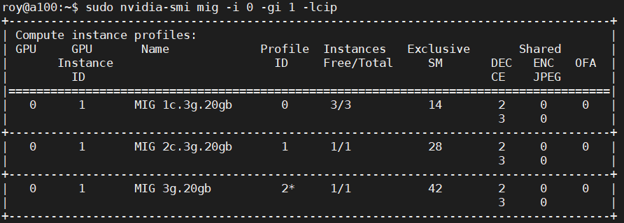
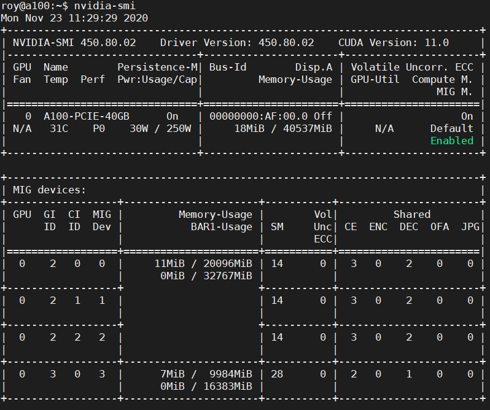
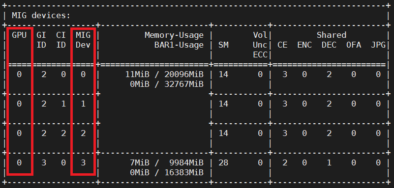

## 名詞解釋

- GPU Engine : GPU Engine 是 GPU 上的工作引擎，如 copy engine (CE)、DMAs、NVDEC、NVENC 等等。
- GPU Memory Slice : GPU Memory Slice 是 GPU 內存的最小單位，一張 GPU 的內存總共由 8 個 GPU Memory Slice 所組成。
- GPU SM Slice : GPU SM Slice 是 GPU SM 的最小單位，一張 GPU 的 SM 總共由 7 個 GPU SM Slice 所組成。
- GPU Slice : GPU Slice 是 GPU 的最小單位，它是由一個 GPU Memory Slice 和一個 GPU SM Slice 所組成。
- GPU Instance (GI) : GPU Instance 是 GPU slices 和 GPU engine 的組合，GPU Instance 中會共享所有 GPU slices 和 GPU engine。其中每個 GPU Instance 可再進一步細分為 Compute Instance。
- Compute Instance (CI) : Compute Instance 是其父類別 GPU Instance 的子集。

## 注意事項

- ~~MIG 模式只能在 CUDA 11 / R450 的 Linux 系統使用，目前驅動版本為 `450.80.02`。~~
- 在設定 MIG 時，使用者須擁有超級用戶的權限。
- 一旦 GPU 為 MIG 模式，即可動態的設置 GPU，無須重啟。
- 當 GPU 為 MIG 模式，不支援 graphics APIs，如 OpenGL, Vulkan 等等。
- 當 GPU 為 MIG 模式，不支援 GPU to GPU P2P。
- 當 GPU 為 MIG 模式，CUDA 應用程式會將 GPU Instance 中的 Compute Instance 視為單個 CUDA 設備。

## 安裝步驟

安裝驅動程式
```
wget https://developer.download.nvidia.com/compute/cuda/repos/ubuntu2204/x86_64/cuda-keyring_1.1-1_all.deb
sudo dpkg -i cuda-keyring_1.1-1_all.deb
sudo apt-get update
# 以下指令會連同驅動一起安裝
sudo apt-get -y install cuda
```

## MIG 設定

### 建立流程

```sh
sudo nvidia-smi -i 0 -mig 1
```


#### 查看 GI 可用組合

總共有五種模式可以選擇，其中 `Instances` 可查詢剩餘可切割的數量。

```sh
sudo nvidia-smi mig -i 0 -lgip
```


H100排列組合圖


以 NVIDIA A100 40G 為例，最大利用率的排列組合如下圖，可根據需求做選擇。


<Callout type='warn'>
  在建立 GI 的順序很重要，建議由大建到小 (如上圖須由左到右)，以免發生記憶體破碎的問題。
</Callout>

#### 建立 GI

假設我要建立兩個 `3g.20gb` 的 GI，建立指令可以用 `Name` 或 `ID`。

```sh
# ID
sudo nvidia-smi mig -i 0 -cgi 9
# Name
sudo nvidia-smi mig -i 0 -cgi 3g.20gb
```


#### 查詢已經建立的 GI

```sh
sudo nvidia-smi mig -i 0 -lgi
```


#### 查看 CI 可用組合

指定 GI (GI Instance ID)，來查詢其 CI 可用的組合，`*` 為預設 CI。

```sh
sudo nvidia-smi mig -i 0 -gi 1 -lcip
```



#### 建立 CI

假設我要建立兩個 `1c.3g.20gb` 的 GI，建立指令可以用 `Name` 或 `ID`。

```sh
# ID
sudo nvidia-smi mig -i 0 -gi 0 -cci 1
# Name
sudo nvidia-smi mig -i 0 -gi 1 -cci 1c.3g.20gb
```


查詢已經建立的 CI (指定 GI)

```sh
sudo nvidia-smi mig -i 0 -gi 1 -lci
```


<Callout type='info'>
如果在建 GI 時，想要用預設的 CI，在建 GI 時加入 `-C` 參數即可。
GPU Driver > `450.80.02` 才有此功能。

範例

```sh
sudo nvidia-smi mig -i 0 -cgi 9 -C
```

</Callout>

### 移除流程


#### 移除 CI

指定 GI 及 CI 來移除 CI。

```sh
sudo nvidia-smi mig -i 0 -gi 1 -ci 0,1 -dci
```


#### 移除 GI

指定 GI 來移除 GI。

```
sudo nvidia-smi mig -i 0 -gi 1 -dgi
```


#### 關閉 MIG 模式

```sh
sudo nvidia-smi -i 0 -mig 0
```


## 使用 MIG

假設目前 GPU MIG 切法如下，一個 `2g.10gb`、三個 `1c.3g.20gb`



可以用 `GPU ID` + `MIG DEV ID` 或 `UUID` 來指派 MIG GPU

### 用 ID 來指派 GPU

ID 查詢如下圖，假設我要指派 `GPU 0` 上的 `MIG DEV 1` 和 `MIG DEV 3`



```sh
sudo docker run -it --rm --gpus '"device=0:1,0:3"' nvcr.io/nvidia/tensorflow:20.11-tf2-py3 bash
```


查詢可用的 MIG GPU


### 用 UUID 來指派 GPU

UUID 查詢如下圖，假設我要指派 `MIG-GPU-bc104fe1-14dd-ddc0-dae2-f13f99547443/2/2`

```sh
nvidia-smi -L
```


```sh
sudo docker run -it --rm --gpus '"device=MIG-GPU-bc104fe1-14dd-ddc0-dae2-f13f99547443/2/2"' nvcr.io/nvidia/tensorflow:20.11-tf2-py3 bash
```


查詢可用的 MIG GPU


## 實際嘗試

```
sudo docker run -d   --name ollama   --gpus '"device=0:0"'   -p 11434:11434   -v $(pwd):/code   -v $(pwd)/api:/root/.ollama   --restart always   ollama/ollama:latest
```


- 使用 llama3.1 8b


- 使用的記憶體量


## 參考資料

[H100排列組合圖](https://docs.nvidia.com/datacenter/tesla/mig-user-guide/index.html#h100-profiles)
