## 目錄

1. [安裝 XRDP 套件](#安裝-xrdp-套件)
2. [常見問題](#常見問題)
3. [使用](#使用)
4. [預設同時連線人數](#預設同時連線人數)
5. [擴充 xrdp session](#擴充-xrdp-session)

## 安裝 XRDP 套件

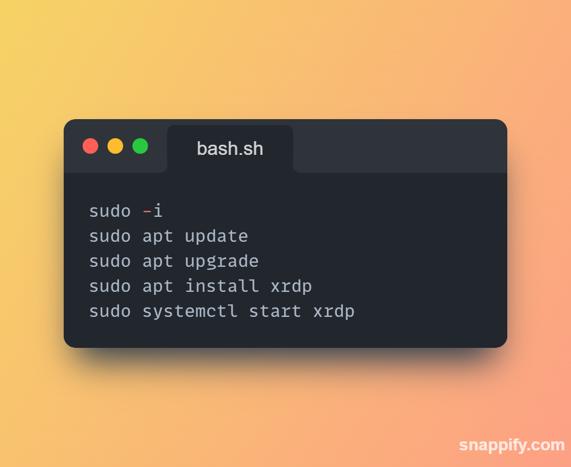

1. 打開終端機
2. 先取得最高權限
3. 更新軟體的最新資訊及列表
4. 更新目前已安裝的軟體到最新版本
5. 安裝 XRDP 套件
6. 啟動 XRDP 服務

## 常見問題

### 連線後無法使用 Firefox

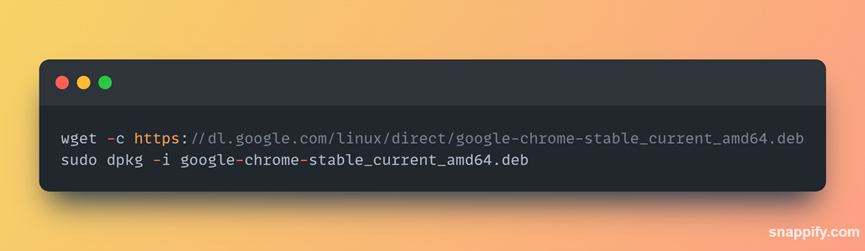

解決方法：安裝 Chrome 瀏覽器。

## 使用

1. 搜尋遠端連線
   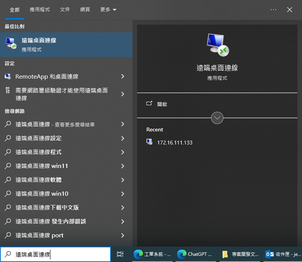
2. 輸入 IP 位置
   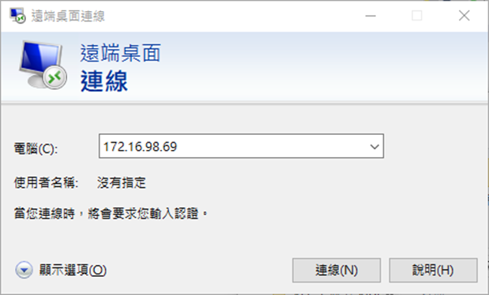
3. 選擇 “是”
   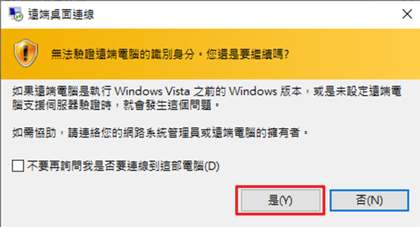
4. 輸入 Linux 帳號密碼
   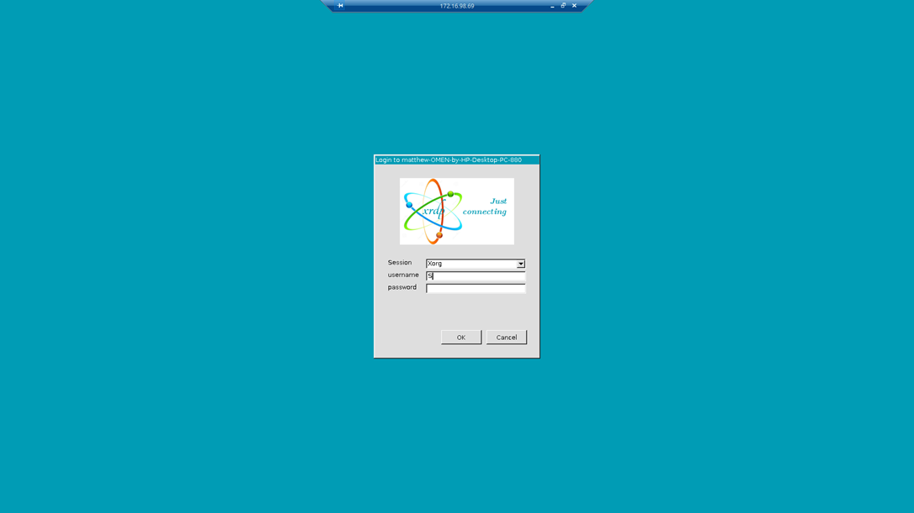
5. 顯示使用者介面
   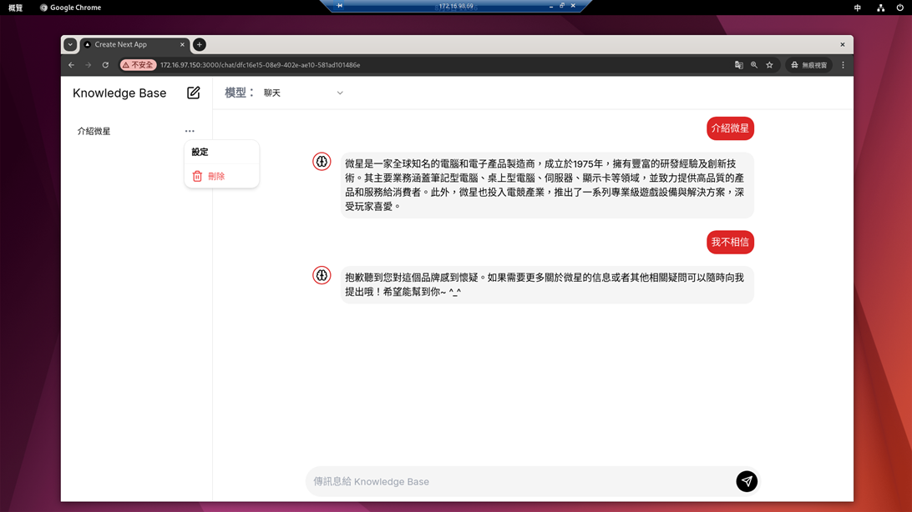

## 預設同時連線人數

- 預設為 10 人，可修改人數上限

<Callout type='error'>若超過 10 人連線，會出現以下視窗</Callout>

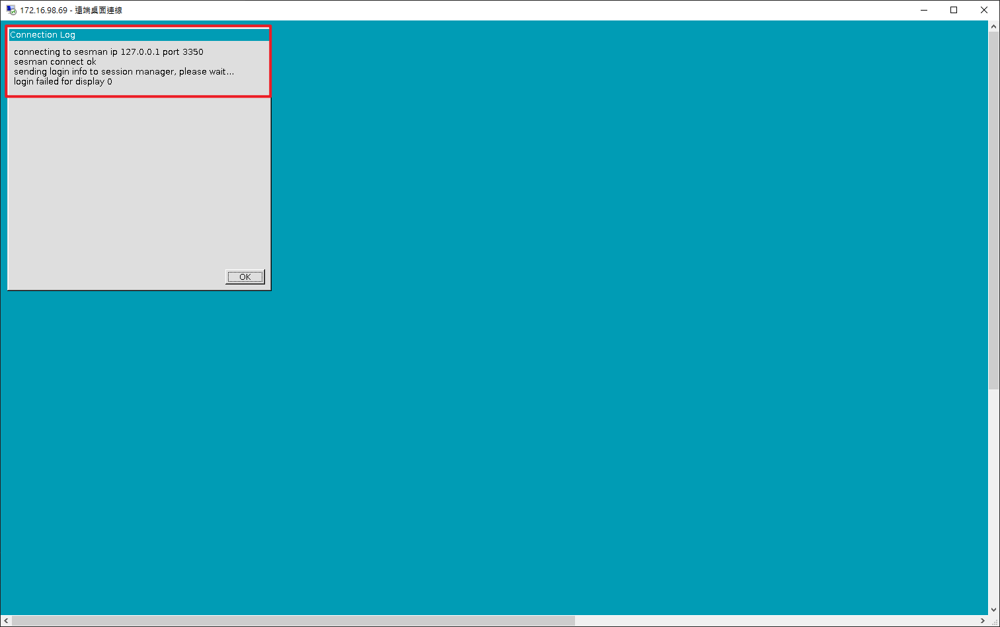

<Callout type='warn'>以下是並未開啟任何視窗的情況</Callout>

- 5 人使用記憶體量 4GB/32GB
  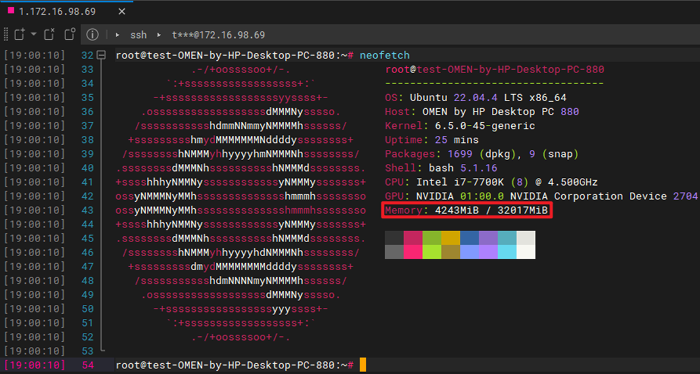
- 10 人使用的記憶體量 7GB/32GB
  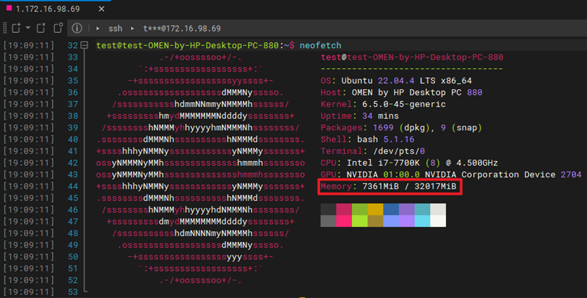
- 15 人使用的記憶體量 13GB/32GB
  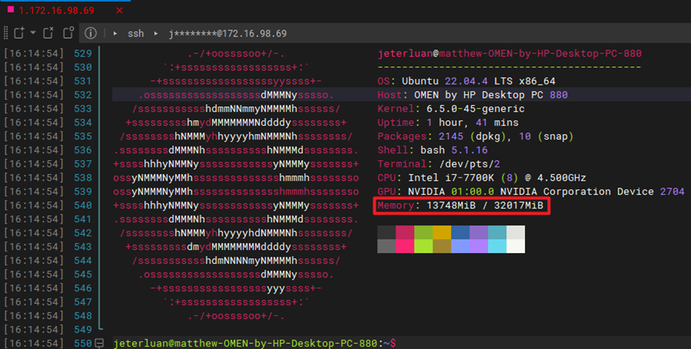
- 表格
  | 使用人數 | 記憶體量 |
  | -------- | --------- |
  | 5 人 | 4GB/32GB |
  | 10 人 | 7GB/32GB |
  | 15 人 | 13GB/32GB |

## 擴充 xrdp session

### 1. 開啟 xrdp 設定檔

在終端機中輸入下方指令：

```bash
sudo vim /etc/xrdp/sesman.ini
```

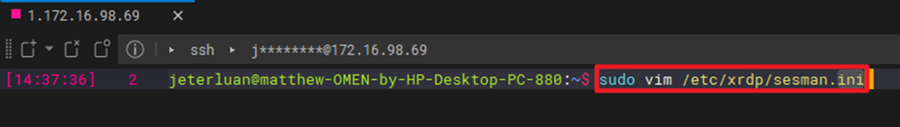

### 2. 修改 MaxSessions 數量

1. 輸入 `i` 進入編輯模式
2. 將 `MaxSessions` 後面的數字（預設為 10）改成所需增加的 session 數量

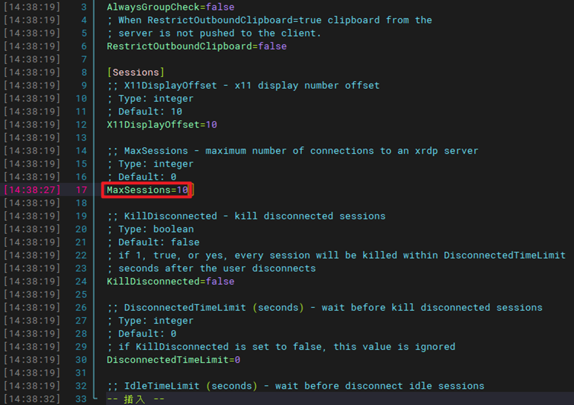
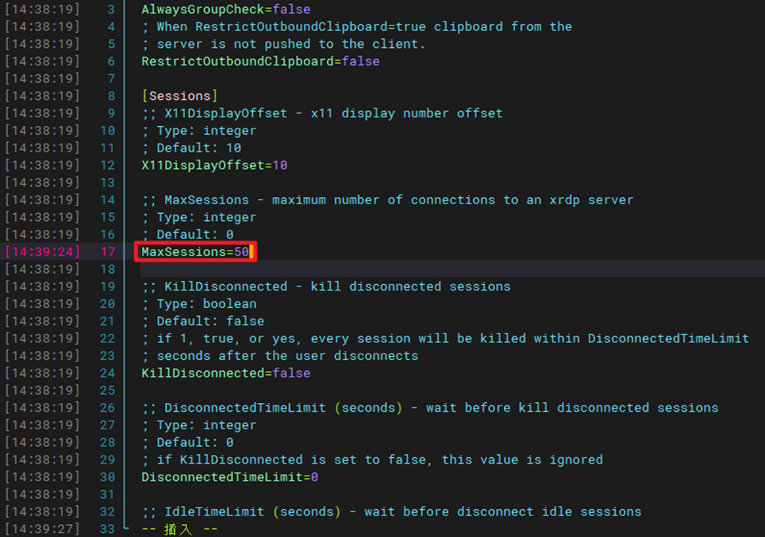

### 3. 存檔並離開

1. 點擊 `esc` 鍵進入指令模式
2. 輸入 `:wq!` 並按 `Enter` 鍵存檔並離開

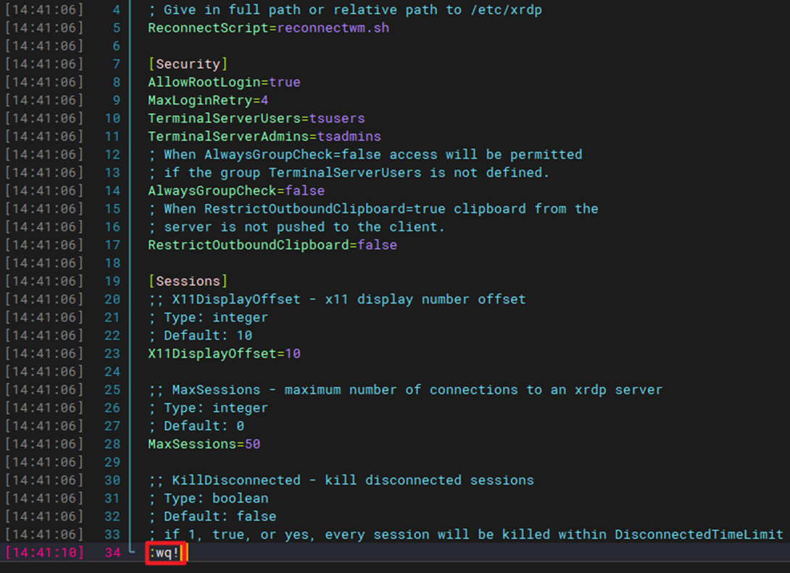

### 4. 重新啟動 xrdp

在終端機中輸入下方指令：

```bash
sudo service xrdp restart
```

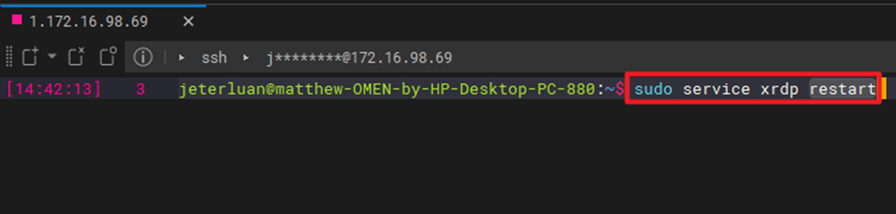
